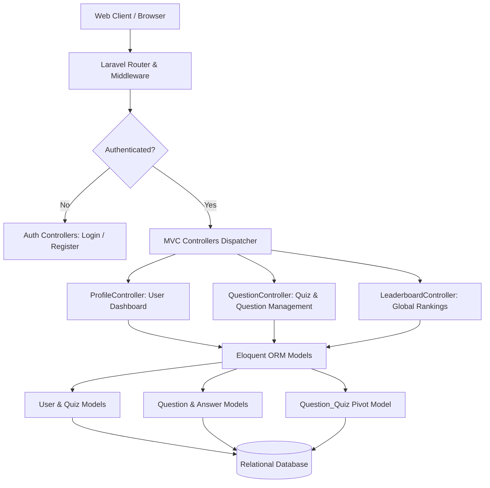
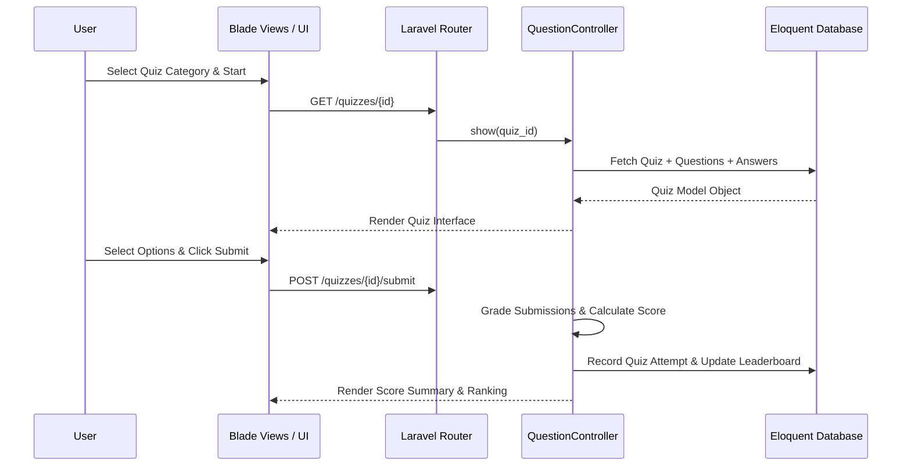

# 🧠 MindQuest

[](https://www.php.net/)
[](https://laravel.com/)
[](LICENSE.md)

**MindQuest** is an interactive web-based assessment platform and quiz management system engineered with PHP and Laravel. Featuring user authentication, question bank management, categorized quiz sessions, real-time score evaluations, and global leaderboards.

---

## ⚡ Key Highlights

- **User Authentication**: Secure user registration, login, session management, and profile customization via Laravel Auth controllers.
- **Categorized Question Bank**: Structured models for Quizzes, Questions, and Answers with support for multiple-choice options.
- **Interactive Evaluation**: Real-time evaluation of user submissions with score calculation and performance stats.
- **Leaderboards**: Competitive ranking views displaying top scoring users per quiz category.
- **RESTful Architecture**: Clean MVC organization with Eloquent ORM database abstractions.

---

## 📋 Table of Contents

- [Key Highlights](#-key-highlights)
- [System Architecture](#-system-architecture)
- [Quiz Taking Sequence Flow](#-quiz-taking-sequence-flow)
- [Setup & Execution](#-setup--execution)
- [Project Directory Structure](#-project-directory-structure)
- [License](#-license)

---

## 🏗️ System Architecture



---

## 📐 Quiz Taking Sequence Flow



---

## 🚀 Setup & Execution

### Prerequisites

- **PHP**: 7.4 or 8.0+
- **Composer**: Dependency manager
- **SQLite / MySQL**: Relational database engine

---

### Setup & Run

1. **Clone Repository**:
   ```bash
   git clone https://github.com/sahmedhusain/mindquest.git
   cd mindquest
   ```

2. **Install Composer Dependencies**:
   ```bash
   composer install
   ```

3. **Configure Environment**:
   ```bash
   cp .env.example .env
   php artisan key:generate
   ```

4. **Run Database Migrations & Seeds**:
   ```bash
   php artisan migrate --seed
   ```

5. **Start Development Server**:
   ```bash
   php artisan serve
   ```
   *MindQuest will start at `http://127.0.0.1:8000`.*

---

## 📂 Project Directory Structure

```
mindquest/
├── app/
│   ├── Http/
│   │   └── Controllers/     # Auth, Profile, Question, & Leaderboard controllers
│   ├── Models/              # User, Quiz, Question, and Answer Eloquent models
│   └── Providers/           # Service providers
├── config/                  # App, database, and auth configurations
├── database/                # Migrations, factories, and seeders
├── public/                  # Public web root
├── resources/               # Blade templates, CSS, and JS assets
├── routes/                  # Web and API routing manifests
├── composer.json            # PHP dependencies & project manifest
└── README.md                # Documentation
```

---

## 📄 License

Distributed under the MIT License. See [LICENSE](LICENSE.md) for details.
